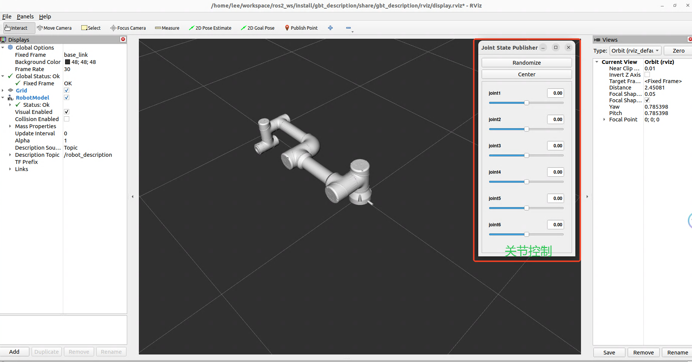

<div align="right">
  
[中文简体](readme_cn.md)

</div>

## Project Overview

This project includes the URDF files for all robot arm models from Shanghai Jiebot. Users can use this project to visualize the robotic arms in RViz and perform simulation and control within the ROS2 ecosystem. Currently, it only includes the **GBT-C5A series robotic arm**, but more robot models and functionalities will be added over time. The URDF model is specifically designed for **simulation** and **visualization** of the robotic arm within ROS2.

## Directory Structure

```
├─config        # Configuration files
├─launch        # Launch files
├─meshes        # 3D models
├─rviz          # RViz configurations
└─urdf          # URDF model files
```

> **Note**: Ensure the directory structure matches the actual package names in the project. For example, if the package name is `gbt_description`, use this name in the directory structure to avoid confusion during file lookups and configuration.

## Installation Requirements

- ROS2 (version: ros2-humble)
- RViz2

## Usage Instructions

1. **Clone or Download the Project**:

   Place the entire folder in the `src` directory of your ROS2 workspace. You can clone the repository with the following command:

   ```bash
   git clone <repository-url>
   ```

2. **Build the Workspace**:

   Run the following commands in the terminal:

   ```bash
   cd {your workspace}
   colcon build
   ```

3. **Set Up the Environment**:

   Run the following command to set up environment variables:

   ```bash
   source install/setup.bash
   ```

4. **Launch Visualization**:

   Use the following command to visualize the robotic arm in RViz:

   ```bash
   ros2 launch gbt_description display_{robot model}.launch.py
   ```

   For example, to visualize the GBT-C5A robotic arm, use:

   ```bash
   ros2 launch gbt_description display_c5a.launch.py
   ```

## Example Usage

**Launch RViz to visualize URDF**


> Example: View the GBT-C5A robotic arm in RViz. Ensure the file path is correct so users can locate `rviz.png`, or replace this image as needed.

## Notes

- Ensure all necessary dependencies are correctly installed.
- If issues arise, verify the ROS2 version and dependencies.

## Troubleshooting

- **URDF Not Loaded Correctly**: Check file paths and URDF file format, ensuring paths are accurate.
- **Model Not Displayed in RViz**: Make sure to run `source install/setup.bash` before launching RViz to load the ROS2 workspace environment.

## Future Development Plans

- [x] Add URDF files for robotic arms
   - [x] GBT-C5A series robotic arm
   - [ ] GBT-C12A series robotic arm
   - [ ] More collaborative robot models
- [ ] Add URDF files for Puma robotic arms
   - [ ] GBT-P7B series robotic arm
   - [ ] Additional Puma robot models

- [ ] Add URDF files for Scara robotic arms
   - [ ] GBT-S3A series robotic arm
   - [ ] Additional Scara robot models

## Contributions

Contributions are welcome! Please provide feedback via issues. For collaboration, follow these steps to contribute code:

1. Create a new branch and keep it synchronized with the main branch before committing.
2. Format code according to project standards.
3. Ensure necessary tests are performed before submission, and provide a brief test description.

## License

This project is licensed under the [BSD-3-Clause](https://opensource.org/license/BSD-3-clause) license, allowing users to freely use, modify, and distribute the code, with the requirement to retain the original copyright statement and disclaimer. By using this project, you agree to the following terms:

- **Allowed**: Free use, modification, and distribution of code.
- **Required**: Retention of the original copyright notice.
- **Disclaimer**: The author is not responsible for any direct or indirect damages resulting from the use of this project.