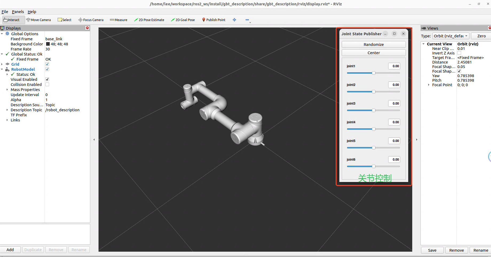

## 项目简介

该项目包含了上海捷勃特所有型号机械臂的URDF文件，用户可以通过此项目在RViz中可视化机械臂，并在ROS2生态中进行仿真和控制。当前仅包含**GBT-C5A系列机械臂**，但未来将逐步添加更多机器人型号和功能。该URDF模型专为在ROS2中实现机械臂的**仿真**和**可视化**而设计。

## 目录结构

```
├─config        # 配置文件
├─launch        # 启动文件
├─meshes        # 3D模型
├─rviz          # RViz配置
└─urdf          # URDF模型文件
```

> **注意**：确保目录结构与项目中的实际包名一致。例如，如果项目包名为`gbt_description`，请在目录结构中使用相同的名称，以避免在文件查找和配置时产生混淆。

## 安装要求

- ROS2（版本 ros2-humble）
- RViz2

## 使用说明

1. **克隆或下载项目**：

   将整个文件夹放置在你的ROS2工作空间的`src`目录下。可以通过以下命令直接克隆仓库：

   ```bash
   git clone <repository-url>
   ```

2. **构建工作空间**：

   在终端中运行以下命令：

   ```bash
   cd {你的工作空间}
   colcon build
   ```

3. **设置环境**：

   运行以下命令以设置环境变量：

   ```bash
   source install/setup.bash
   ```

4. **启动可视化**：

   在终端中输入以下命令，以在RViz中可视化机械臂：

   ```bash
   ros2 launch gbt_description display_{机器人型号}.launch.py
   ```

   例如，对于GBT-C5A机械臂，命令如下：

   ```bash
   ros2 launch gbt_description display_c5a.launch.py
   ```

## 使用示例

**启动RViz可视化urdf**


> 示例：在RViz中查看GBT-C5A机械臂的可视化效果。确保文件路径正确，以便用户可以找到`rviz.png`，或根据需求替换该图片。

## 注意事项

- 请确保所有必要的依赖已正确安装。
- 如果遇到问题，请检查ROS2版本和依赖关系。

## 故障排除

- **URDF未正确加载**：请检查文件路径和URDF文件格式，确保路径正确无误。
- **RViz未显示模型**：确保在启动RViz之前已正确运行`source install/setup.bash`，以加载ROS2的工作环境。


## 后续开发计划

- [x] 添加写作机器人的URDF文件
   - [x] GBT-C5A系列机械臂
   - [ ] GBT-C12A系列机械臂
   - [ ] 更多协作机器人型号
- [ ] 添加Puma机械臂的URDF文件
   - [ ] GBT-P7B系列机械臂
   - [ ] 更多Puma机器人型号

- [ ] 添加Scara机械臂的URDF文件
   - [ ] GBT-S3A系列机械臂
   - [ ] 更多Scara机器人型号


## 贡献

欢迎贡献代码和提出意见！请通过issue来进行反馈。为了更好的协作，请按照以下步骤进行代码贡献：

1. 在提交代码前，请创建一个新的分支并保持代码与主分支的同步。
2. 格式化代码以符合项目规范。
3. 提交前请确保已进行必要的测试，并提供简要的测试说明。

## 许可证

本项目采用 [BSD-3-Clause](https://opensource.org/license/BSD-3-clause) 许可证。该许可证允许用户自由使用、修改和分发代码，但要求保留原始版权声明和免责声明。使用本项目即表示您同意该条款：

- **允许**：自由使用、修改和分发代码。
- **要求**：保留原始的版权声明。
- **免责声明**：作者不对使用本项目造成的任何直接或间接损害负责。

