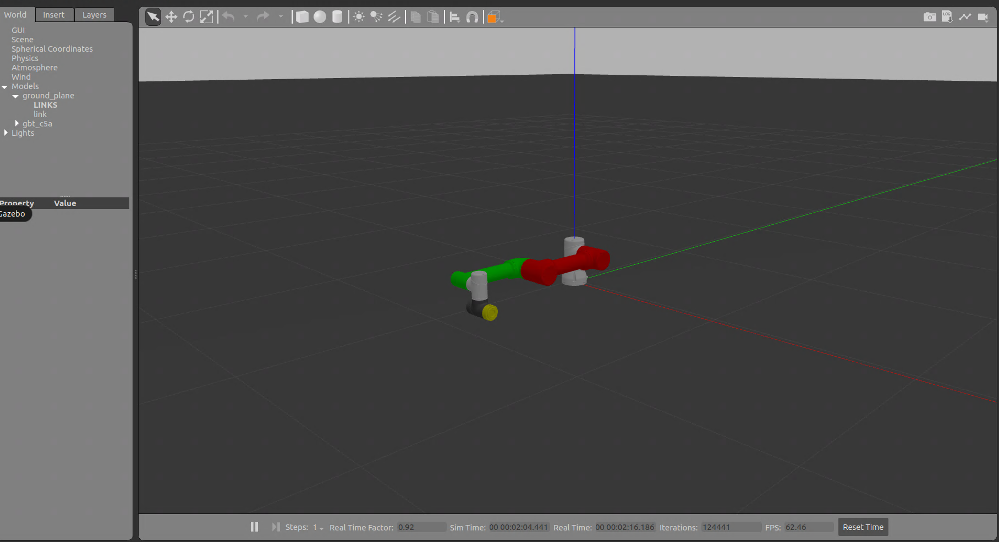

<div align="right">
  
[中文简体](readme_cn.md)

</div>

# gbt_gazebo Configuration Package

## Overview

This package is used to configure and simulate the robot environment in Gazebo. It provides the necessary configuration files and launch files to load and control the robot in Gazebo.

## Directory Structure

```plaintext
├── CMakeLists.txt
├── config
├── launch
└── package.xml
```

- **CMakeLists.txt**: Build system configuration file.
- **config**: Contains configuration files needed for Gazebo simulation (such as Gazebo world files, control parameters, etc.).
- **launch**: Contains launch files for quickly starting the Gazebo simulation environment.
- **package.xml**: Metadata file for the ROS 2 package, describing dependencies and other information.

## Dependencies

- ROS 2 Humble
- Gazebo
- Robot description file package (e.g., `gbt_description`)

## Quick Start

1. Copy the `gbt_gazebo` folder to the `src` directory of your ROS workspace.
2. Go to the workspace and build it:

   ```bash
   cd {your_ROS2_workspace}
   colcon build
   source install/setup.bash
   ```

### Launching Gazebo Simulation

```bash
ros2 launch gbt_gazebo gazebo_demo.launch.py <robot_type>:=<robot_type> controller_name:={controller_name}
```

For example:

```bash
ros2 launch gbt_gazebo gazebo_demo.launch.py robot_type:=C5A controller_name:=gbt_c5a_arm_controller
```

>The controller name is usually `gbt_<robot_type>_arm_controller`, please refer to the corresponding robot controller configuration file in the `gbt_moveit` package for the specific name.
>For example: `gbt_moveit_config/c5a_moveit_config/config/ros2_controllers.yaml`
>The `controller_name` parameter is optional. If left empty, it will be automatically generated using the default naming rule: `gbt_{robot_type.lower()}_arm_controller`.

## Usage Example



## Configuration and Customization

You can customize the Gazebo simulation environment by modifying the files in the `config` directory, including adjusting physical parameters, adding or removing objects, and more.

## Notes

If Gazebo does not shut down properly, use the following command to close it:

```bash
kill -9 $(ps aux | grep '[g]azebo' | awk '{print $2}')
```

## License

This project is licensed under the [BSD-3-Clause License](https://opensource.org/license/BSD-3-clause).
