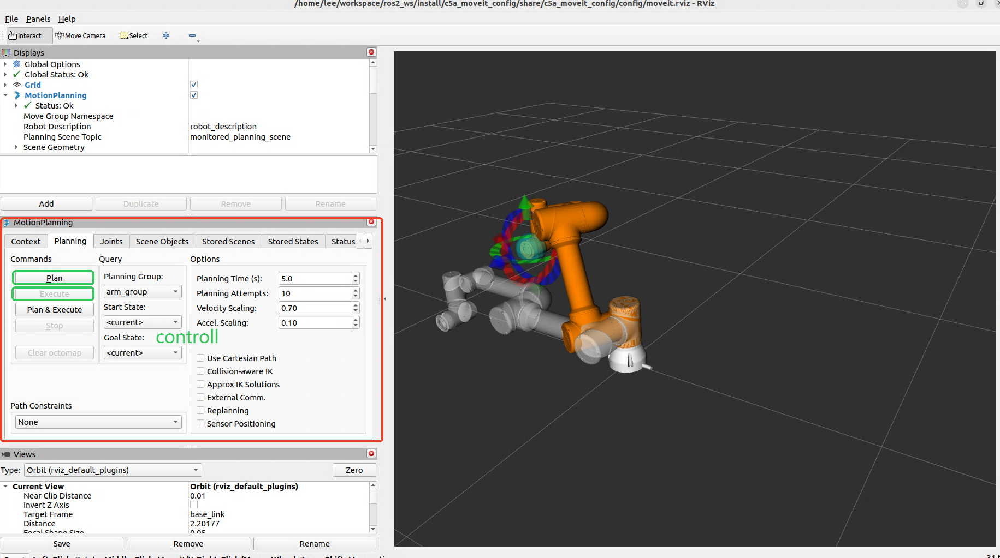
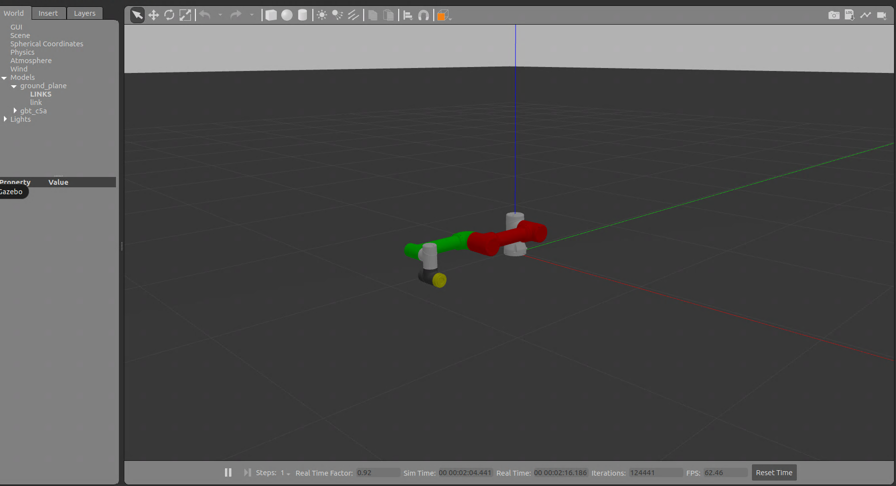

<div align="right">
  
[中文简体](readme_cn.md)

</div>

# Agiblebot Robot ROS2 Project
# MoveIt Demo

## Introduction
This project uses the MoveIt Setup Assistant to generate MoveIt2 configuration files for the robot.

For operation instructions, please refer to: https://moveit.picknik.ai/main/doc/examples/setup_assistant/setup_assistant_tutorial.html#step-1-start

## Dependencies
- ROS2 Humble
- RViz2
- MoveIt2
- Gazebo

## Usage Instructions

### Preparation

1. Copy this folder to the `src` directory of your ROS workspace.
2. Also, copy the `gbt_description` folder to the `src` directory of your ROS workspace.
3. If you want to launch `Gazebo`, copy the `gbt_gazebo` folder to the `src` directory of your ROS workspace.

### Build

```bash
cd {your ROS2 workspace}
colcon build
source install/setup.bash
```

### Launch MoveIt2 Configuration

```bash
ros2 launch {robot_model}_moveit_config demo.launch.py
```
For example:
```bash
ros2 launch c5a_moveit_config demo.launch.py
```

### Launch MoveIt2 + Gazebo Simulation

**Terminal 1**: Launch Gazebo simulation
```bash
source install/setup.bash
ros2 launch {robot_model}_moveit_config gazebo.launch.py
```
For example:
```bash
source install/setup.bash
ros2 launch c5a_moveit_config gazebo.launch.py
```

**Terminal 2**: Launch MoveIt2 motion planning
```bash
source install/setup.bash
ros2 launch {robot_model}_moveit_config gazebo_moveit_rviz.launch.py
```
For example:
```bash
source install/setup.bash
ros2 launch c5a_moveit_config gazebo_moveit_rviz.launch.py
```

## Examples

**MoveIt**


**Gazebo**


**MoveIt + Gazebo**


## Future Development Plans

- [ ] Add MoveIt2 configuration files for robots
   - [x] GBT-C5A series robotic arm
   - [ ] GBT-C12A series robotic arm
   - [ ] Additional collaborative robot models

- [ ] Support for more robotic arm types
   - [ ] Puma series robotic arms (e.g., GBT-P7B series)
   - [ ] Scara series robotic arms (e.g., GBT-S3A series)

## Troubleshooting

- If MoveIt2 planning fails, check the terminal output for errors and try adjusting the target position.
-  If MoveIt2 execution fails, check if the controller name configuration in `config/ros2_controller.yaml` matches the setup in the launch file.

## License
This project is licensed under the [BSD-3-clause License](https://opensource.org/license/BSD-3-clause).