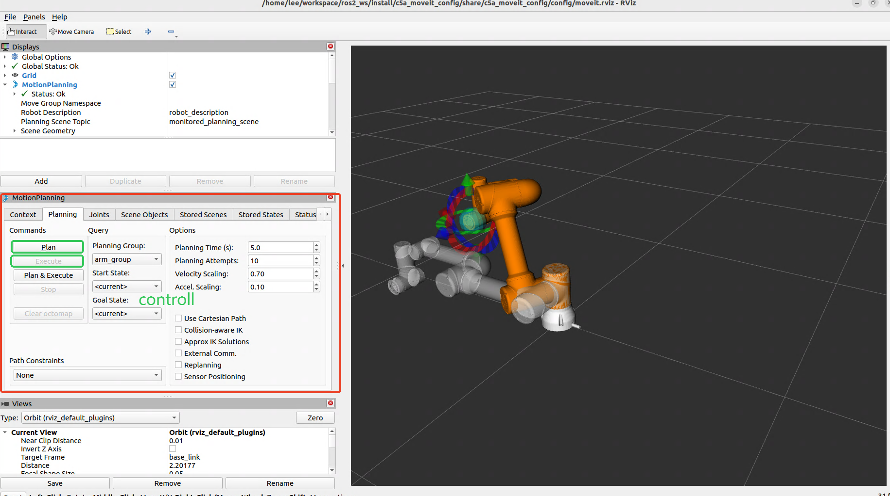
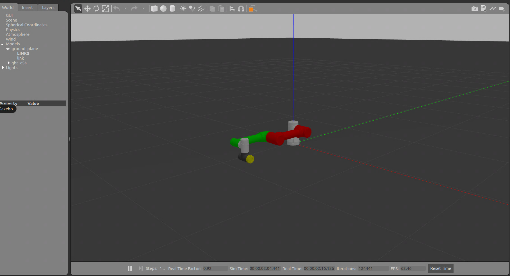
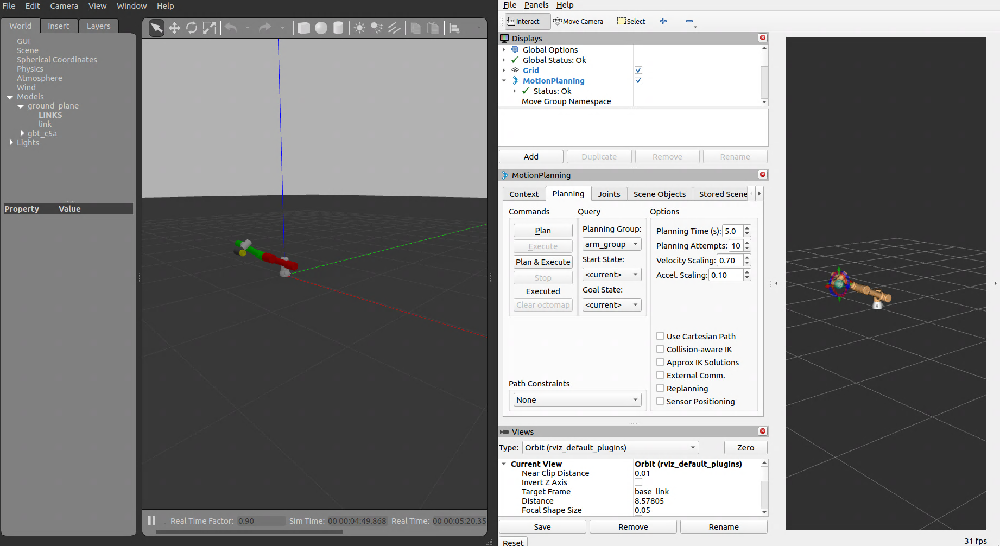

#  Moveit Demo

## 简介
本项目使用MoveIt Setup Assistant 生成机器人的MoveIt2 配置文件。

操作说明请参考：https://moveit.picknik.ai/main/doc/examples/setup_assistant/setup_assistant_tutorial.html#step-1-start


## 依赖项
- ROS2-Humble
- RViz2
- MoveIt2
- Gazebo

## 使用说明

### 准备

1. 将此文件夹复制到您的 ROS 工作空间的 `src` 目录下。
2. 同时将 `gbt_description` 文件夹复制到您的 ROS 工作空间的 `src` 目录下
3. 若要启动`gazebo`,请将·`gbt_gazebo` 文件夹复制到您的 ROS 工作空间的 `src` 目录下


### 编译
```bash
cd {你的ROS2工作空间}
colcon build 
source install/setup.bash
```


### 启动 MoveIt2 配置

```bash
ros2 launch {机器人型号}_moveit_config demo.launch.py
```
比如：
```bash
ros2 launch c5a_moveit_config demo.launch.py
```

### 启动 MoveIt2+Gazebo 仿真

**终端1**：启动gazebo仿真
```bash
source install/setup.bash
ros2 launch {机器人型号}_moveit_config gazebo.launch.py
```
比如：
```bash
source install/setup.bash
ros2 launch c5a_moveit_config gazebo.launch.py
```

**终端2**：启动moveit2 运动规划
```bash
source install/setup.bash
ros2 launch {机器人型号}_moveit_config gazebo_moveit_rviz.launch.py
```
比如：
```bash
source install/setup.bash
ros2 launch c5a_moveit_config gazebo_moveit_rviz.launch.py
```

## 使用示例

**moveit**


**gazebo**


**moveit+gazebo**



## 后续开发计划

- [ ] 添加机器人MoveIt2配置文件
   - [x] GBT-C5A系列机械臂
   - [ ] GBT-C12A系列机械臂
   - [ ] 更多协作机器人型号


- [ ] 支持更多机械臂类型
   - [ ] Puma系列机械臂（GBT-P7B系列等）
   - [ ] Scara系列机械臂（GBT-S3A系列等）


## 故障排除

- 如果在MoveIt2规划失败，请查看终端输出，查看是否有错误信息，并尝试调整目标位置。
- 如果在MoveIt2执行失败，请查看终端输出，是否是ros2_controller 控制器名称配置错误，需要与`config/ros2_controller.yaml`中一致。


## 许可证
此项目采用 [BSD-3-clause 许可证](https://opensource.org/license/BSD-3-clause)。


