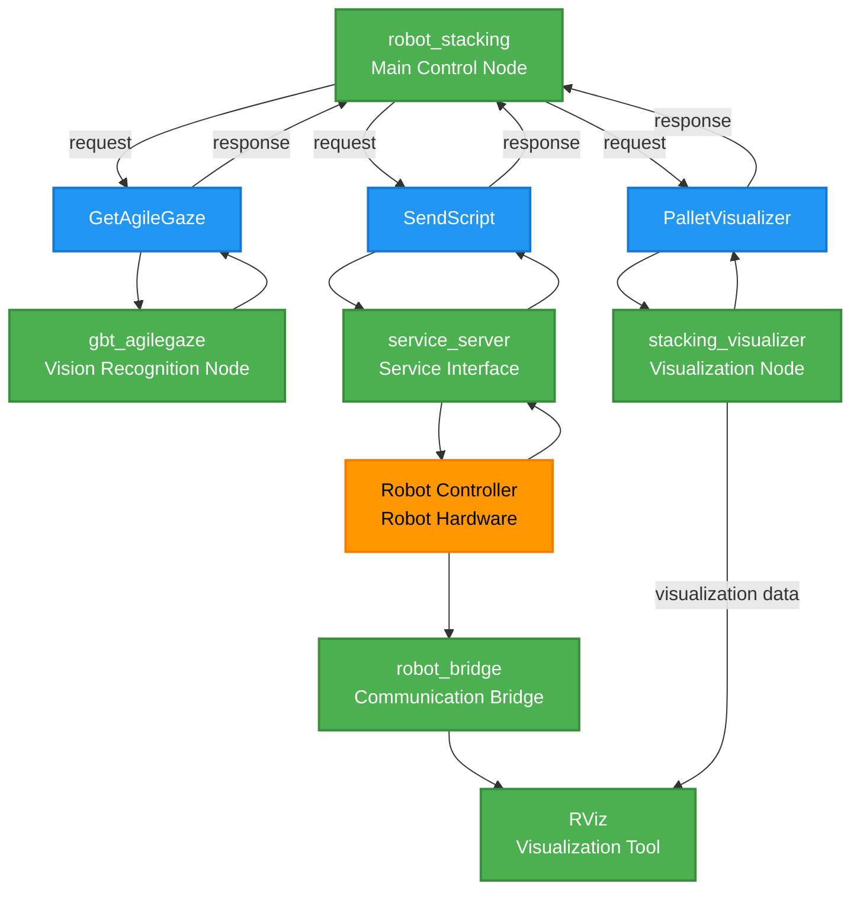
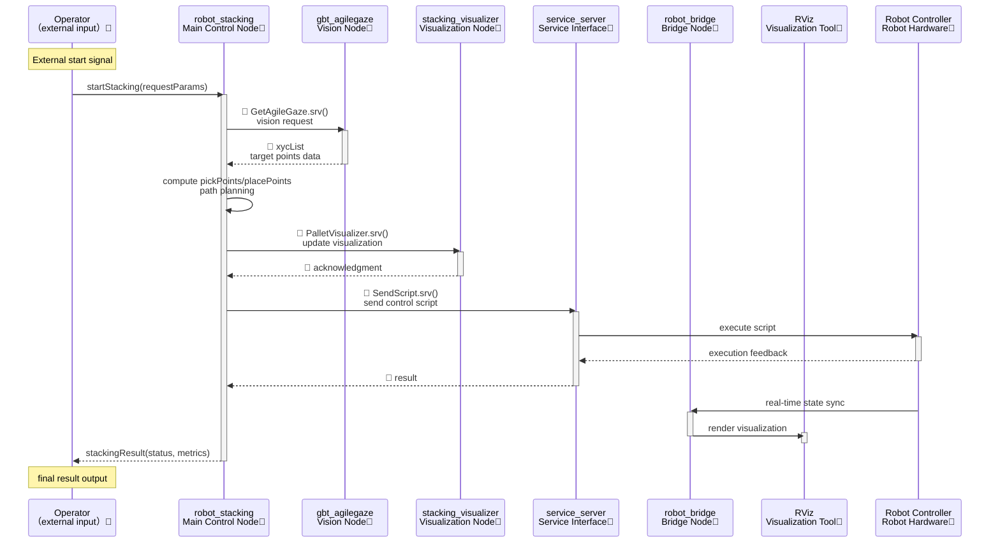

<div align="right">

[Chinese Simplified](readme_cn.md)|[English](#)

</div>

# ROS2 Robot Stacking Demo Documentation

[TOC]

## Overview

This project uses ROS2 packages to control the Shanghai Agilebot collaborative robot for stacking tasks, integrating vision processing, stacking algorithms, and robotic arm control. It supports both physical robots and virtual simulation environments. The intended audience should have a basic understanding of ROS2 and robotic programming.

## Environment Dependencies

* **Operating System**: Ubuntu 22.04
* **Core Framework**: ROS2 Humble
* **Robot Drivers**:

  * Shanghai Agilebot ROS-driver package (version >= V0.0.1)
  * Python SDK (version = V1.6.3.2)
* **Vision System**:

  * AgileGaze (Shanghai Agilebot’s in-house vision software) or compatible simulation node
* **Robot Requirements**:

  * Shanghai Agilebot collaborative robot (physical or simulated)
  * Software: Copper ≥ V7.6.0.1

> **Virtual Environment Note**: Supported for testing in simulation. You can apply to Shanghai Agilebot for a virtual controller license.

---

## Configuration File Descriptions

| Configuration File           | Path                                     | Main Settings                                                                     |
| ---------------------------- | ---------------------------------------- | --------------------------------------------------------------------------------- |
| **Robot Configuration**      | `../gbt_driver/config/robot_config.yaml` | Robot IP address and other connection parameters                                  |
| **Stacking Parameters**      | `config/stacking_params.yaml`            | Stacking algorithm parameters, pick/place workframe settings, initial joint poses |
| **Visualization Parameters** | `config/pallet_viz_params.yaml`          | Parameters for stacking visualization display                                     |

> Please modify the configuration files according to your actual application scenario. Detailed parameter descriptions are provided in the file comments.

---

## System Interfaces

Includes interfaces for the vision system (AgileGaze) and visualization tool (stacking\_visualizer).

### Vision Service Interface

* **Service Type**: `gbt_stacking_interface/srv/GetAgileGaze`
* **Description**: Retrieves the target object’s center coordinates (x, y) and orientation angle (c) from the vision system.

```bash
# Request
---

# Response
gbt_stacking_interface/AgileGaze AgileGaze
```

> For detailed AgileGaze interface, see: [AgileGaze Interface Documentation](../gbt_vision/readme_cn.md)

### RVIZ Stacking Visualization Service

* **Service Type**: `gbt_stacking_interface/srv/PalletVisualizer`
* **Description**: Updates the stacking visualization points.

```bash
# Request
geometry_msgs/Point[] grasp_points  # Coordinates of pick points
geometry_msgs/Point[] place_points  # Coordinates of place points

# Response
bool success     # Execution status
string message   # Status message
```

---

## System Node Architecture

### Node Topology Diagram



### Legend

1. **Node Types** (Green Rectangles):

   * `robot_stacking`: Main control node coordinating the system
   * `gbt_agilegaze`: Vision recognition node processing images
   * `stacking_visualizer`: Visualization node displaying intermediate results
   * `service_server`: Service interface node providing control commands
   * `robot_bridge`: Communication bridge with hardware
   * `RViz`: ROS visualization tool
2. **Non-Node Entities**:

   * 🔶 **Entity** (Orange Oval):

     * `Robot Controller`: The physical robot hardware
   * 🔷 **Service** (Blue Oval):

     * `GetAgileGaze`: Vision service
     * `PalletVisualizer`: Visualization update service
     * `SendScript`: Script-sending service

---

## Core Module Functions

| Module Name              | Function Description                                                                      |
| ------------------------ | ----------------------------------------------------------------------------------------- |
| **gbt\_AgileGaze**       | Interfaces with AgileGaze vision system, provides target coordinates (x, y) and angle (c) |
| **robot\_stacking**      | Main stacking controller coordinating vision, planning, and execution                     |
| **stacking\_visualizer** | Real-time visualization of pick and place points                                          |
| **service\_server**      | ROS-driver service gateway forwarding control commands                                    |
| **robot\_bridge**        | Syncs robot state to RViz for visualization                                               |
| **Robot Controller**     | The robot hardware interface                                                              |

---

## Workflow

Below is the updated workflow diagram with color rules matching the topology graph:



### Legend Table

| Element Type    | Color/Marking         | Example                         |
| --------------- | --------------------- | ------------------------------- |
| ROS Node        | 💚 Green background   | robot\_Stacking, gbt\_AgileGaze |
| Hardware Entity | 🧡 Orange background  | Robot Controller                |
| Service Call    | 🔷 Blue diamond       | GetAgileGaze.srv()              |
| External Input  | 💜 Purple background  | Operator                        |
| Data Feedback   | Solid arrow (no mark) | xycList, execution result       |

---

## Quick Start Guide (Simulation)

Simulation mode uses a fake AgileGaze node and does not require a real vision setup.

### Preparation

1. Install ROS2 Humble and project dependencies.
2. Download and install the Shanghai Agilebot ROS-driver package (see [Installation Guide](../readme_cn.md)).
3. Configure the robot IP in `robot_config.yaml` located at `../gbt_driver/config/robot_config.yaml`.
4. In Agilelink, set up the gripper or suction IO mapping (default DO port 1).

### Launch Commands

```bash
# Build the project
colcon build
source install/setup.bash

# Launch system (simulation mode example)
ros2 launch gbt_stacking gbt_stacking.launch.py fake:=True <robot_type>:=<robot_type>

# Terminal 2 (manual trigger)
source install/setup.bash
ros2 service call /gbt_stacking/external_trigger  gbt_stacking_interface/srv/ExternalStackingTrigger "{trigger: True}"
```

### Parameters

| Parameter    | Options           | Description                           |
| ------------ | ----------------- | ------------------------------------- |
| `fake`       | True/False        | Enable simulation mode (default true) |
| `robot_type` | C5A/C7A/C12A/C16A | Robot type                           |

---

## Vision System Integration Guide

### Using AgileGaze

1. **Camera Calibration**:

   * Use the AgileGaze calibration board to compute pixel-to-UF coordinate transformation.
2. **Pick Area Calibration**:

   * Measure the pick area origin and X/Y direction points in the base frame.
   * Update `uf_grasp_points` in `stacking_params.yaml`.
3. **Place Area Calibration**:

   * Measure the place area origin and X/Y direction points in the base frame.
   * Update `uf_place_points` in `stacking_params.yaml`.
4. **Initial Pose Setup**:

   * Configure safe initial joint angles in `init_joints`.

### Custom Vision Implementation

1. Implement a compatible service:

   ```python
   # Custom vision node template
   import rclpy
   from gbt_stacking_interface.srv import GetAgileGaze

   class CustomVisionNode(Node):
       def __init__(self):
           super().__init__('custom_vision')
           self.srv = self.create_service(
               GetAgileGaze,
               '/gbt_vision/service/AgileGaze',
               self.vision_callback)
       
       def vision_callback(self, request, response):
           # Implement custom vision logic
           response.AgileGaze = ...
           return response
   ```

2. Ensure service interface matches:

   * Service name: `/gbt_vision/service/AgileGaze`
   * Service type: `gbt_stacking_interface/srv/GetAgileGaze`

---

## Notes

1. **Safety**:

   * Always test first in simulation mode.
   * Ensure the e-stop is functional before real operations.
   * Verify the area is clear of obstacles to avoid collisions.
2. **Configuration Check**:

   * Confirm all YAML files are correct before launching.
