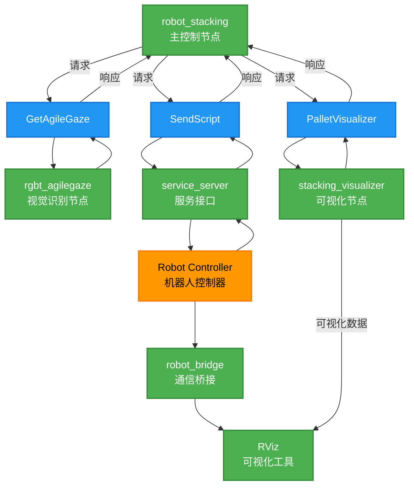
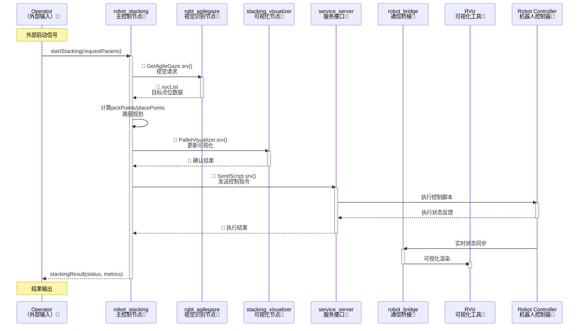

<div align="right">
  
[中文简体](#)|[English](readme.md)

</div>

# ROS2 机器人码垛demo文档

[TOC]

## 概述

本项目使用 ROS2 软件包控制上海捷勃特协作机器人执行码垛任务，集成了视觉处理、码垛算法和机械臂控制功能，支持物理机器人和虚拟仿真环境运行。目标读者需具备一定的 ROS2 和机器人编程基础。

## 环境依赖

- **操作系统**：Ubuntu 22.04
- **核心框架**：ROS2 Humble
- **机器人驱动**：
  - 上海捷勃特机器人 ROS-driver 软件包（版本号>=V0.0.1）
  - Python SDK (版本 = V1.6.3.2)
- **视觉系统**：
  - AgileGaze（上海捷勃特自研视觉软件）或兼容的模拟节点
- **机器人要求**：
  - 上海捷勃特协作机器人（物理机或虚拟仿真）
  - 软件：Copper ≥ V7.6.0.1

> **虚拟环境说明**：支持在仿真环境中运行测试，可向上海捷勃特公司申请虚拟控制器使用许可。

---

## 配置文件说明

| 配置文件 | 路径 | 主要配置内容 |
|----------|------|--------------|
| **机器人配置** | `../gbt_driver/config/robot_config.yaml` | 机器人IP地址等连接参数 |
| **码垛参数** | `config/stacking_params.yaml` | 码垛算法参数、抓取/放置工作面参数、初始关节配置 |
| **可视化参数** | `config/pallet_viz_params.yaml` | 码垛可视化显示参数 |

> 请根据实际应用场景修改相应配置文件，详细参数说明见文件内注释。

---

## 系统接口

包含视觉系统（AgileGaze）和可视化系统（stacking_visualizer）的接口服务。

### 视觉接口服务

- **服务类型**：`gbt_stacking_interface/srv/GetAgileGaze`
- **服务描述**：获取视觉系统检测到的目标物体中心坐标(x,y)和偏转角(c)

```bash
# 请求
---

# 响应
gbt_stacking_interface/AgileGaze AgileGaze
```

> AgileGaze接口详见：[AgileGaze接口文档](../gbt_vision/readme_cn.md)

### RVIZ码垛可视化服务

- **服务类型**：`gbt_stacking_interface/srv/PalletVisualizer`
- **服务描述**：更新码垛可视化点坐标

```bash
# 请求
geometry_msgs/Point[] grasp_points  # 抓取点坐标
geometry_msgs/Point[] place_points  # 放置点坐标

# 响应
bool success     # 执行状态
string message   # 状态信息
```

---

## 系统节点架构

### 节点拓扑图



### 图例说明

1. **节点类型**（绿色矩形）：
   - `robot_stacking`：主控制节点（协调整个系统）
   - `rgbt_agilegaze`：视觉识别节点（处理图像数据）
   - `stacking_visualizer`：可视化节点（显示中间结果）
   - `service_server`：服务接口（提供控制指令接口）
   - `robot_bridge`：通信桥接（硬件接口层）
   - `RViz`：ROS可视化工具（3D显示）

2. **非节点类型**：
   - 🔶 **实体Entity**（橙色椭圆）：
     - `Robot Controller`：机器人控制器（物理设备）
   - 🔷 **服务Service**（蓝色椭圆）：
     - `GetAgileGaze`：视觉识别服务
     - `PalletVisualizer`：可视化服务
     - `SendScript`：脚本发送服务

### 核心模块功能

| 模块名称 | 功能描述 |
|----------|----------|
| **rgbt_agilegaze** | 对接AgileGaze视觉系统，提供目标物体的中心坐标(x,y)和偏转角(c) |
| **robot_stacking** | 码垛主控制器，协调视觉、算法和执行流程 |
| **stacking_visualizer** | 实时可视化抓取点和放置点 |
| **service_server** | ROS-driver服务网关，转发控制指令 |
| **robot_bridge** | 同步机器人状态到RViz可视化界面 |
|**Robot Controller**|机器人控制器|

---

## 工作流程

以下是根据节点拓扑图着色规则修正的工作流程图，严格匹配拓扑图的颜色定义：



### 图例对照表

| 元素类型 | 颜色/标记 | 示例 |
|----------|-----------|------|
| ROS节点 | 💚 绿色背景 | robot_stacking, rgbt_agilegaze |
| 物理实体 | 🧡 橙色背景 | Robot Controller |
| 服务调用 | 🔷 蓝色菱形标记 | GetAgileGaze.srv() |
| 外部接口 | 💜 紫色背景 | Operator |
| 数据反馈 | 无标记实线 | xycList, 执行结果 |

### 流程说明

该系统的工作流程可分为以下6个核心步骤：

1. **启动触发**  
操作员发送启动指令给主控节点（robot_Stacking），携带码垛参数请求。

2. **视觉识别**  
主控节点调用AgileGaze视觉系统，通过`GetAgileGaze.srv()`服务获取目标物体的坐标(x,y)和偏转角(c)数据列表。

3. **路径规划**  
主控节点基于视觉数据自主计算抓取点(pickPoints)和放置点(placePoints)的运动轨迹。

4. **可视化更新**  
通过`PalletVisualizer.srv()`服务向可视化模块同步实时抓放点位信息，RViz界面渲染机器人状态。

5. **机器人执行**  
主控节点经`SendScript.srv()`服务下发控制指令，机器人控制器执行抓取/码垛动作并反馈执行状态。

6. **状态同步**  
机器人实时状态通过robot_bridge组件同步至RViz，最终向操作员返回码垛任务结果及性能指标。

---

## 快速开始指南(模拟运行)

模拟运行是指使用一个模拟的AgileGaze节点模拟视觉系统，不涉及视觉系统的搭建。

### 准备工作

1. 安装ROS2 Humble和项目依赖
2. 下载并安装上海捷勃特机器人ROS-driver软件包，请参考[安装指南](../readme_cn.md)
3. 配置`robot_config.yaml`中的机器人IP，配置文件位置：[robot_config.yaml](../gbt_driver/config/robot_config.yaml)
4. 在Agilelink中配置夹持器或者吸盘的IO映射（默认使用DO,端口为1）

### 启动命令

```bash
# 构建项目
colcon build
source install/setup.bash

# 启动系统（虚拟模式示例）
ros2 launch gbt_stacking gbt_stacking.launch.py   fake:=True  <robot_type>:=<机器人型号>

# terminal 2 (manul trigger)
source install/setup.bash
ros2 service call /gbt_stacking/external_trigger  gbt_stacking_interface/srv/ExternalStackingTrigger "{trigger: True}"
```

### 参数说明

| 参数 | 可选值 | 说明 |
|------|--------|------|
| `fake` | True/False | 启用虚拟模式(默认true) |
| `robot_type` | C5A/C7A/C12A/C16A | 机器人型号 |

---

## 视觉系统集成指南

### 使用AgileGaze

1. **相机标定**：
   - 使用AgileGaze标定板计算像素坐标系到UF坐标系的转换
2. **工作面标定**：
   - 在基坐标系中测量抓取工作面原点、X/Y轴方向点
   - 更新`stacking_params.yaml`中的`uf_grasp_points`
3. **放置区标定**：
   - 在基坐标系中测量放置工作面原点、X/Y轴方向点
   - 更新`stacking_params.yaml`中的`uf_place_points`
4. **初始位姿设置**：
   - 配置安全初始关节角度`init_joints`

### 自定义视觉方案

1. 实现兼容接口：

   ```python
   # 自定义视觉节点模板
   import rclpy
   from gbt_stacking_interface.srv import GetAgileGaze

   class CustomVisionNode(Node):
       def __init__(self):
           super().__init__('custom_vision')
           self.srv = self.create_service(
               GetAgileGaze, 
               '/gbt_vision/service/AgileGaze', 
               self.vision_callback)
       
       def vision_callback(self, request, response):
           # 实现自定义视觉处理逻辑
           response.AgileGaze = ... 
           return response
   ```

2. 确保服务接口匹配：
   - 服务名称：`/gbt_vision/service/AgileGaze`
   - 服务类型：`gbt_stacking_interface/srv/GetAgileGaze`

---

## 注意事项

1. **安全操作**：
   - 首次运行请在虚拟模式下测试
   - 真实环境操作前确认急停开关可用
   - 确认周围无障碍物，避免碰撞
2. **配置验证**：
   - 启动前检查所有yaml配置文件
