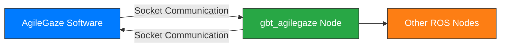

<div align="right">
  
[简体中文](readme_cn.md)|[English](#)

</div>

# Shanghai Agilebot Robotics ROS2-AgileGaze Vision Package Documentation

## Document Revision History

| Version     | Date           | Notes                                  |
| :---------  | :------------- | :------------------------------------- |
| v0.0.1.0    | May 7, 2025    | Added example of obtaining AgileGaze vision processing results via Socket in ROS2 |

---

## Table of Contents

[TOC]

---

## 1. Introduction

This document describes how to communicate between ROS2 and the AgileGaze vision processing software to achieve image processing and object recognition functionality.
> AgileGaze is a vision processing software developed by Shanghai Agilebot Robotics Co., Ltd., integrating advanced vision algorithms and coordinate transformation functions. For details, please contact relevant personnel.

---

## 2. System Architecture



**Communication Flow:**

1. The `gbt_agilegaze` node communicates with the AgileGaze software through a Socket interface.
2. AgileGaze processes images and returns results to the `gbt_agilegaze` node.
3. The `gbt_agilegaze` node parses the results and sends them to other ROS nodes.

---

## 3. Operation Guide

### 3.1 Prerequisites

1. Install and launch the AgileGaze vision processing software.
2. Configure the required vision processing workflow.
3. Obtain the IP address of the computer running AgileGaze.
4. Construct the Socket command based on the workflow name (default port: `5622`).

### 3.2 Configuration Methods

#### Method 1: Modify Launch File

Edit [`gbt_vision/gbt_agilegaze.launch.py`](launch/gbt_agilegaze.launch.py):

```python
AgileGaze_node = Node(
    package='gbt_vision',
    executable='gbt_agilegaze',
    name='gbt_agilegaze',
    parameters=[{
        'host': '172.17.26.57',    # IP of AgileGaze host
        'port': 5622,              # Communication port
        'cmd': 'RUN_FIND, a1\n',   # Workflow command
        'fake': False              # Use simulated data
    }]
)
```

#### Method 2: Command Line

```bash
ros2 launch gbt_vision gbt_agilegaze.launch.py   host:=172.17.26.57  port:=5622  cmd:='RUN_FIND, a1\n' fake:=True       
```

> **Parameter Description**:
>
> - `host`: IP address of the machine running AgileGaze
> - `port`: Communication port (default 5622)
> - `cmd`: Workflow execution command (`RUN_FIND, [workflow name]\n`)
> - `fake`: Enable simulated data mode (no actual communication with AgileGaze)

### 3.3 Verify Message Content

After launching the node, use the following command to simulate sending requests and verify the returned message content:

```bash
ros2 service call /gbt_vision/service/AgileGaze gbt_stacking_interface/srv/GetAgileGaze "{}"
```

---

## 4. gbt_vision Message Description

### 4.1 AgileGaze Message Structure

[AgileGaze.msg](../gbt_stacking_interface/msg/AgileGaze.msg):

```ros2
int32    code            # Return status code
string   message         # Status message
string   process_name    # Process name
int32    quantity        # Number of detected objects
VRItem[] vr_list         # List of object pose information
```

### 4.2 VRItem Message Structure

[VRItem.msg](../gbt_stacking_interface/msg/VRItem.msg):

```ros2
int32  model_id          # Template ID / Step ID
uint8  coordinate_type   # Coordinate type
uint8  coordinate_id     # Coordinate system ID
float64 x                # X-coordinate value
float64 y                # Y-coordinate value
float64 c                # Rotation angle
```

---

## 5. AgileGaze Output Examples

### 5.1 Successful Match Example

```json
{
    "code": 0,
    "message": "",
    "process_name": "demo_procedure",
    "quantity": 2,
    "vr_list": [
        {
            "model_id": 3,
            "coordinate_type": 1,
            "coordinate_id": 0,
            "x": 9141.9462890625,
            "y": 10662.8193359375,
            "c": 0
        },
        {
            "model_id": 2,
            "coordinate_type": 1,
            "coordinate_id": 0,
            "x": 16227.8154296875,
            "y": 10815.826171875,
            "c": 14
        }
    ]
}
```

### 5.2 Zero Match Example

```json
{
    "code": 0,
    "message": "",
    "process_name": "demo_procedure",
    "quantity": 0,
    "vr_list": null
}
```

### 5.3 Error Example

```json
{
    "code": 1,
    "message": "Feature vector not generated",
    "process_name": "",
    "quantity": 0,
    "vr_list": null
}
```

---

## 6. Parameter Description

### 6.1 General Parameters

| Field Name      | Type   | Description                                                                 |
|-----------------|--------|-----------------------------------------------------------------------------|
| code            | int32  | **Return Status Code**: 0-success, non-zero-error                           |
| message         | string | **Error Message**: Contains detailed error description when code≠0          |
| process_name    | string | **Workflow Name**: Name of the executed vision workflow                     |
| quantity        | int32  | **Detection Count**: Number of matched objects (0 means no match)           |
| vr_list         | VRItem[]| **Pose List**: Array of object pose information; null if quantity=0       |

### 6.2 Data Field Parameters

| Field Name      | Condition             | Description                                     |
|-----------------|-----------------------|--------------------------------------------------|
| process_name    | Valid when code=0     | Executed vision workflow name                   |
| quantity        | Valid when code=0     | Number of detected objects                      |
| vr_list         | Valid when code=0 and quantity>0 | Object pose list                          |

### 6.3 vr_list Field Parameters

| Field Name          | Type   | Description                                                                 |
|---------------------|--------|------------------------------------------------------------------------------|
| model_id            | int32  | **Template ID**: In legacy workflows it's template ID, in drag-and-drop workflows it's step ID |
| coordinate_type     | uint8  | **Coordinate Type**: <br>1-Offset from reference point (user coordinate system)<br>2-Tool coordinate system (not supported yet)<br>3-User coordinate system |
| coordinate_id       | uint8  | **Coordinate ID**: Identifier for the coordinate system used                |
| x                   | float64| **X-Coordinate**: X position in the coordinate system                       |
| y                   | float64| **Y-Coordinate**: Y position in the coordinate system                       |
| c                   | float64| **Rotation Angle**: Orientation angle of the object (in radians)            |

> **Detailed Explanation of coordinate_type**:
>
> 1. **Reference Point Offset**: Returns offset relative to the template focus point in user coordinate system
> 2. **Tool Coordinate System**: Not supported in current version
> 3. **User Coordinate System**: x, y, c values are absolute poses in this coordinate system

---

## 7. Notes

1. **Network Configuration**:
   - Ensure network connectivity between the ROS2 node host and AgileGaze host
   - Check firewall settings to ensure port 5622 is open

2. **Command Format**:
   - Socket commands must end with a newline character (`\n`)
   - Workflow names are case-sensitive

3. **Error Handling**:
   - When `code ≠ 0`, ignore all other fields
   - Detailed error messages can be found in the `message` field

4. **Simulation Mode**:
   - Use built-in simulated data when `fake=True`
   - Simulated data is suitable for development and testing environments

5. **Coordinate Transformation**:
   - Verify coordinate system transformations before deployment
   - Pay attention to unit conversions
