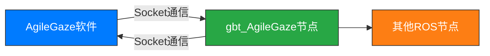

<div align="right">
  
[中文简体](#)|[English](readme.md)

</div>

# 上海捷勃特机器人ROS2-AgileGaze视觉包说明

## 文件修订记录

| 版本号     | 时间           | 备注                                  |
| :--------- | :------------- | :------------------------------------ |
| v0.0.1.0   | 2025年5月7日   | 添加了ROS2通过Socket获取AgileGaze视觉处理软件的案例 |

## 目录

[TOC]

---

## 1. 简介

本文档介绍了如何通过ROS2与AgileGaze视觉处理软件进行通信，实现图像处理和物体识别功能。
> AgileGaze是上海捷勃特机器人有限公司开发的视觉处理软件，集成了先进的视觉算法和坐标系转换功能。详情请联系相关人员咨询。
---

## 2. 系统架构



**通信流程：**

1. gbt_AgileGaze节点通过Socket接口与AgileGaze软件进行通信
2. AgileGaze软件处理图像并返回结果给gbt_AgileGaze节点
3. gbt_AgileGaze节点解析结果并发送至其他ROS节点

---

## 3. 操作指南

### 3.1 准备工作

1. 安装并启动AgileGaze视觉处理软件
2. 配置所需的视觉处理流程图
3. 获取AgileGaze所在计算机的IP地址
4. 根据流程图名称拼接Socket命令（默认端口：`5622`）

### 3.2 配置运行方式

#### 方式一：修改Launch文件配置

编辑 [`gbt_vision/gbt_AgileGaze.launch.py`](launch/gbt_agilegaze.launch.py) 文件：

```python
AgileGaze_node = Node(
    package='gbt_vision',
    executable='gbt_agilegaze',
    name='gbt_agilegaze',
    parameters=[{
        'host': '172.17.26.57',    # AgileGaze主机IP
        'port': 5622,              # 通信端口
        'cmd': 'RUN_FIND, a1\n',   # 流程图命令
        'fake': False              # 是否使用模拟数据
    }]
)
```

#### 方式二：命令行直接启动

```bash
ros2 launch gbt_vision gbt_agilegaze.launch.py   host:=172.17.26.57  port:=5622  cmd:='RUN_FIND, a1\n' fake:=True              
```

> **参数说明**：
>
> - `host`: AgileGaze所在主机的IP地址
> - `port`: 通信端口（默认5622）
> - `cmd`: 流程图执行命令（`RUN_FIND, [流程图名称]\n`）
> - `fake`: 启用模拟模式（不与实际AgileGaze通信）

### 3.3 验证消息内容

启动节点后，可以使用以下命令模拟发送请求并验证返回的消息内容：

```bash
ros2 service call /gbt_vision/service/AgileGaze gbt_stacking_interface/srv/GetAgileGaze "{}"

```

---

## 4. gbt_vision消息说明

### 4.1 AgileGaze消息结构

[AgileGaze.msg](../gbt_stacking_interface/msg/AgileGaze.msg)：

```ros2
int32    code            # 返回状态码
string   message         # 状态消息
string   process_name    # 流程名称
int32    quantity        # 识别到的物体数量
VRItem[] vr_list         # 物体位姿信息列表
```

### 4.2 VRItem消息结构

[VRItem.msg](../gbt_stacking_interface/msg/VRItem.msg)：

```ros2
int32  model_id          # 模板ID/步骤ID
uint8  coordinate_type   # 坐标类型
uint8  coordinate_id     # 坐标系ID
float64 x                # X坐标值
float64 y                # Y坐标值
float64 c                # 旋转角度
```

---

## 5. AgileGaze输出内容说明

### 5.1 成功匹配示例

```json
{
    "code": 0,
    "message": "",
    "process_name": "demo_procedure",
    "quantity": 2,
    "vr_list": [
        {
            "model_id": 3,
            "coordinate_type": 1,
            "coordinate_id": 0,
            "x": 9141.9462890625,
            "y": 10662.8193359375,
            "c": 0
        },
        {
            "model_id": 2,
            "coordinate_type": 1,
            "coordinate_id": 0,
            "x": 16227.8154296875,
            "y": 10815.826171875,
            "c": 14
        }
    ]
}
```

### 5.2 零匹配结果示例

```json
{
    "code": 0,
    "message": "",
    "process_name": "demo_procedure",
    "quantity": 0,
    "vr_list": null
}
```

### 5.3 错误情况示例

```json
{
    "code": 1,
    "message": "特征向量未生成",
    "process_name": "",
    "quantity": 0,
    "vr_list": null
}
```

---

## 6. 参数说明

### 6.1 通用参数

| 字段名      | 类型   | 说明                                                                 |
|-------------|--------|----------------------------------------------------------------------|
| code        | int32  | **返回状态码**：0-成功，非0-错误                                     |
| message     | string | **错误信息**：当code≠0时，包含详细的错误描述                         |
| process_name| string | **流程名称**：当前执行的视觉流程名称                                 |
| quantity    | int32  | **识别数量**：成功匹配的物体数量（0表示未匹配到任何物体）            |
| vr_list     | VRItem[]| **位姿列表**：匹配物体的位姿信息数组，quantity=0时为null             |

### 6.2 data字段参数

| 字段名      | 条件               | 说明                                     |
|-------------|--------------------|------------------------------------------|
| process_name| code=0时有效      | 当前执行的视觉流程名称                   |
| quantity    | code=0时有效      | 识别到的物体数量                         |
| vr_list     | code=0且quantity>0 | 物体位姿信息列表                         |

### 6.3 vr_list字段参数

| 字段名          | 类型   | 说明                                                                 |
|-----------------|--------|----------------------------------------------------------------------|
| model_id        | int32  | **模板标识**：旧版流程中为模板ID，拖拽式流程中为步骤ID               |
| coordinate_type | uint8  | **坐标类型**：<br>1-基准点偏移（用户坐标系下）<br>2-工具坐标系（暂不支持）<br>3-用户坐标系 |
| coordinate_id   | uint8  | **坐标系ID**：使用的坐标系标识                                       |
| x               | float64| **X坐标**：物体在坐标系中的X位置                                     |
| y               | float64| **Y坐标**：物体在坐标系中的Y位置                                     |
| c               | float64| **旋转角度**：物体的方向角（弧度）                                   |

> **coordinate_type详解**：
>
> 1. **基准点偏移**：返回在用户坐标系下，以模板关注点为基准的偏移位置
> 2. **工具坐标系**：当前版本暂不支持
> 3. **用户坐标系**：返回的x、y、c均为在该用户坐标系下的绝对位姿

---

## 7. 注意事项

1. **网络配置**：
   - 确保ROS2节点主机与AgileGaze主机网络互通
   - 检查防火墙设置，确保5622端口开放

2. **命令格式**：
   - Socket命令必须以换行符(`\n`)结尾
   - 流程图名称区分大小写

3. **错误处理**：
   - 当`code ≠ 0`时，忽略其他字段内容
   - 详细错误信息参考`message`字段

4. **模拟模式**：
   - `fake=True`时使用内置模拟数据
   - 模拟数据可用于开发和测试环境

5. **坐标转换**：
   - 实际使用前需验证坐标系转换关系
   - 注意单位转换
