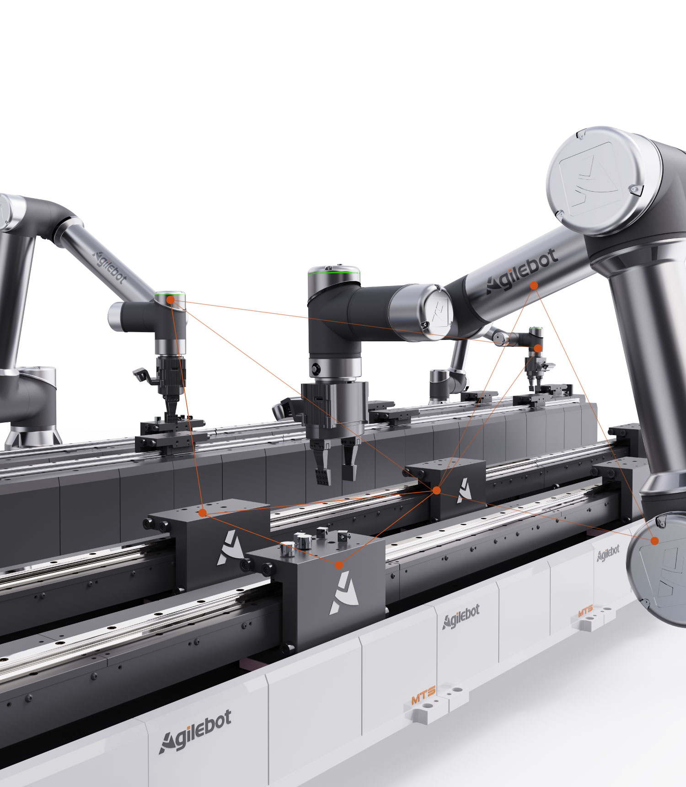

<div align="right">

[中文简体](readme_cn.md)

</div>

# Shanghai Agilebot Robotics ROS2 Project

## Project Overview

This repository provides ROS2 support for Shanghai Agilebot Robotics products (official website: [http://www.sh-agilebot.com](http://www.sh-agilebot.com)). It includes URDF description files, Gazebo configurations, and MoveIt2 configurations, as well as MoveIt2 motion planning, offline trajectory execution, and various demos and examples.

## About Agilebot

Shanghai Agilebot Robotics focuses on industrial robots and intelligent conveying systems, delivering robot hardware, control systems, and software solutions for smart manufacturing scenarios. Built on strengths in motion control, integrated drive-and-control architecture, and system integration, Agilebot continuously provides high-performance, easy-to-deploy, and scalable automation products and services.




## Project Structure
```
├── assets                        # Asset files
├── common                        # Common utilities
├── gbt_description               # URDF descriptions
├── gbt_driver                    # Core ROS2 packages
├── gbt_gazebo                    # Gazebo simulation configs
├── gbt_interface                 # Message and service interfaces
├── gbt_moveit_config             # MoveIt2 configuration
├── gbt_stacking                  # Palletizing demo
├── gbt_stacking_interface        # Palletizing interfaces
└── gbt_vision                    # Vision packages and demos
```

For detailed installation and usage instructions, please refer to the official documentation:
[https://dev.sh-agilebot.com/docs/ros/en/](https://dev.sh-agilebot.com/docs/ros/en/)

## Contact

If you have any suggestions or would like to contribute, please reach out to us:

* Official Website: [https://www.sh-agilebot.com/](https://www.sh-agilebot.com/)
* Email: [info@agilebot.com.cn](mailto:info@agilebot.com.cn)
* Phone: 400-996-7588

## Contributing

Contributions are welcome! Please see the CONTRIBUTING guide for details.

## License

This project is released under the **BSD 3-Clause License**. Please ensure you understand and agree to the terms before using.
