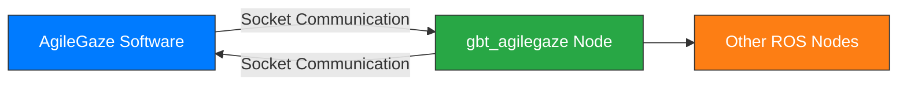

# ROS2-AgileGaze Communication

---

## 1. Introduction

This document describes how to communicate with AgileGaze vision processing software via ROS2 in order to achieve image processing and object recognition capabilities.

> **Note**: AgileGaze is a vision processing software developed by Shanghai Agilebott Robotics Co., Ltd., which integrates advanced vision algorithms and coordinate system transformation functions. For more information, please contact the relevant personnel.

---

## 2. System Architecture


**Communication Flow:**
1. The `gbt_agilegaze` node communicates with the AgileGaze software via a Socket interface.
2. AgileGaze processes the image and returns the result to the `gbt_agilegaze` node.
3. The `gbt_agilegaze` node parses the result and sends it to other ROS nodes.

---

## 3. Operation Guide

### 3.1 Prerequisites
1. Install and launch the AgileGaze vision processing software.
2. Configure the required vision processing flowchart.
3. Obtain the IP address of the computer running AgileGaze.
4. Construct the Socket command based on the flowchart name (default port: `5622`).

### 3.2 Configuration Methods

#### Method One: Modify Launch File
Edit the file `gbt_vision/launch/gbt_agilegaze.launch.py`
```python
AgileGaze_node = Node(
    package='gbt_vision',
    executable='gbt_agilegaze',
    name='gbt_agilegaze',
    parameters=[{
        'host': '172.17.26.57',    # IP address of the AgileGaze host
        'port': 5622,              # Communication port
        'cmd': 'RUN_FIND, a1\n',   # Flowchart command
        'fake': False              # Whether to use simulated data
    }]
)
```

#### Method Two: Start from Command Line
```bash
ros2 launch gbt_vision gbt_agilegaze.launch.py host:=172.17.26.57 port:=5622 cmd:='RUN_FIND, a1\n' fake:=True
```

> **Parameter Description**:
> - `host`: IP address of the computer where AgileGaze is running
> - `port`: Communication port (default is 5622)
> - `cmd`: Flowchart execution command (`RUN_FIND, [flowchart_name]\n`)
> - `fake`: Enable simulation mode (does not communicate with actual AgileGaze)

### 3.3 Verify Message Content
After launching the node, you can use the following command to simulate sending a request and verify the returned message content:
```bash
ros2 service call /gbt_vision/service/AgileGaze gbt_stacking_interface/srv/GetAgileGaze "{}"
```

---

## 4. gbt_vision Message Specification

### 4.1 AgileGaze Message Structure
`gbt_stacking_interface/msg/AgileGaze.msg`
```
int32    code            # Return status code
string   message         # Status message
string   process_name    # Process name
int32    quantity        # Number of detected objects
VRItem[] vr_list         # List of object pose information
```

### 4.2 VRItem Message Structure
`gbt_stacking_interface/msg/VRItem.msg`:
```
int32  model_id          # Template ID / Step ID
uint8  coordinate_type   # Coordinate type
uint8  coordinate_id     # Coordinate system ID
float64 x                # X-coordinate value
float64 y                # Y-coordinate value
float64 c                # Rotation angle
```

---

## 5. AgileGaze Output Examples

### 5.1 Successful Match Example
```json
{
    "code": 0,
    "message": "",
    "process_name": "demo_procedure",
    "quantity": 2,
    "vr_list": [
        {
            "model_id": 3,
            "coordinate_type": 1,
            "coordinate_id": 0,
            "x": 9141.9462890625,
            "y": 10662.8193359375,
            "c": 0
        },
        {
            "model_id": 2,
            "coordinate_type": 1,
            "coordinate_id": 0,
            "x": 16227.8154296875,
            "y": 10815.826171875,
            "c": 14
        }
    ]
}
```

### 5.2 Zero Match Result Example
```json
{
    "code": 0,
    "message": "",
    "process_name": "demo_procedure",
    "quantity": 0,
    "vr_list": null
}
```

### 5.3 Error Example
```json
{
    "code": 1,
    "message": "Feature vector not generated",
    "process_name": "",
    "quantity": 0,
    "vr_list": null
}
```

---

## 6. Parameter Description

### 6.1 General Parameters
| Field Name      | Type   | Description                                                                 |
|-----------------|--------|-----------------------------------------------------------------------------|
| code            | int32  | **Return status code**: 0 - success, non-zero - error                      |
| message         | string | **Error message**: Contains detailed error description when `code ≠ 0`     |
| process_name    | string | **Process name**: Name of the currently executed vision process            |
| quantity        | int32  | **Detection count**: Number of matched objects (0 means no match found)    |
| vr_list         | VRItem[] | **Pose list**: Array of matched object poses; `null` if `quantity = 0` |

### 6.2 Data Field Parameters
| Field Name      | Condition           | Description                                      |
|-----------------|---------------------|--------------------------------------------------|
| process_name    | Valid when `code=0`| Name of the executed vision process             |
| quantity        | Valid when `code=0`| Number of detected objects                      |
| vr_list         | Valid when `code=0` and `quantity>0` | List of object pose information |

### 6.3 vr_list Field Parameters
| Field Name          | Type   | Description                                                                 |
|---------------------|--------|-----------------------------------------------------------------------------|
| model_id            | int32  | **Template Identifier**: Template ID in legacy flows, step ID in drag-and-drop flows |
| coordinate_type     | uint8  | **Coordinate Type**:<br>1 - Offset from base point (in user coordinate system)<br>2 - Tool coordinate system (not supported yet)<br>3 - User coordinate system |
| coordinate_id       | uint8  | **Coordinate System ID**: Identifier for the used coordinate system         |
| x                   | float64| **X Coordinate**: X position of the object in the coordinate system        |
| y                   | float64| **Y Coordinate**: Y position of the object in the coordinate system        |
| c                   | float64| **Rotation Angle**: Orientation angle of the object (in radians)           |

> **Details of coordinate_type**:
> 1. **Offset from Base Point**: Returns the offset position relative to the template focus point under the user coordinate system.
> 2. **Tool Coordinate System**: Not supported in current version.
> 3. **User Coordinate System**: `x`, `y`, and `c` are absolute poses in this coordinate system.

---

## 7. Notes

1. **Network Configuration**:
   - Ensure network connectivity between the ROS2 node host and AgileGaze host.
   - Check firewall settings to ensure that port 5622 is open.

2. **Command Format**:
   - Socket commands must end with a newline character (`\n`).
   - Flowchart names are case-sensitive.

3. **Error Handling**:
   - When `code ≠ 0`, ignore the contents of other fields.
   - Refer to the `message` field for detailed error descriptions.

4. **Simulation Mode**:
   - When `fake=True`, built-in simulated data is used.
   - Simulated data is suitable for development and testing environments.

5. **Coordinate Transformation**:
   - Verify the coordinate system transformation before deployment.
   - Pay attention to unit conversions.

