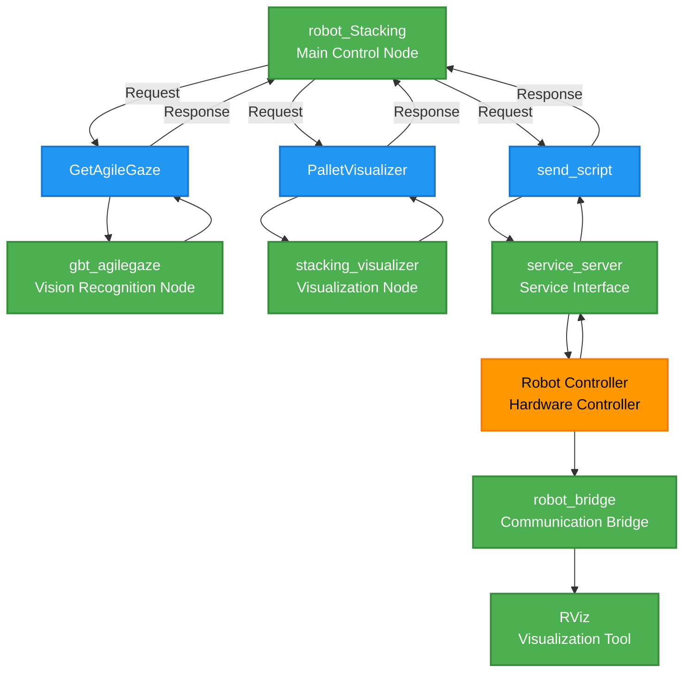
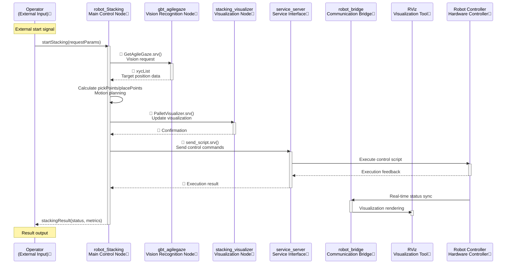

# ROS2 Robot Stacking (Palletizing)

## Overview
This project demonstrates controlling Shanghai Agilebot collaborative robots for palletizing tasks using ROS2 software packages. It integrates vision processing, stacking algorithms, and robotic arm control functions, supporting both physical robots and virtual simulation environments. Readers should have basic knowledge of ROS2 and robot programming.


## System Requirements
- **Operating System**: Ubuntu 22.04
- **Core Framework**: ROS2 Humble
- **Robot Drivers**:
  - Shanghai Agilebot ROS-driver package (version >= v0.0.1)
  - Python SDK (version >= v1.6.3.2)
- **Vision System**:
  - AgileGaze (Agilebot proprietary vision software) or compatible simulation node
- **Robot Requirements**:
  - Shanghai Agilebot collaborative robot (physical or virtual simulation)
  - Software: Copper ≥ v7.6.0.1

> **Virtual Environment Note**: Simulation environment support available. Contact Agilebot for virtual controller license.

---

## System Architecture

### Node Topology Diagram


### Legend:
1. **Node Types** (Green Rectangles):
   - `robot_Stacking`: Main control node (system coordinator)
   - `gbt_agilegaze`: Vision recognition node (image processing)
   - `stacking_visualizer`: Visualization node (result display)
   - `service_server`: Service interface (control commands)
   - `robot_bridge`: Communication bridge (hardware interface)
   - `RViz`: ROS visualization tool (3D display)

2. **Non-Node Entities**:
   - 🔶 **Entity** (Orange):
     - `Robot Controller`: Physical robot controller
   - 🔷 **Service** (Blue):
     - `GetAgileGaze`: Vision recognition service
     - `PalletVisualizer`: Visualization service
     - `send_script`: Script transmission service

---

## Core Module Functions

| Module Name | Function Description |
|----------|----------|
| **gbt_agilegaze** | Interfaces with AgileGaze system, provides object center coordinates (x,y) and rotation angle (c) |
| **robot_stacking** | Main stacking controller, coordinates vision, algorithms, and execution |
| **stacking_visualizer** | Visualizes grasp/placement points in real-time |
| **service_server** | ROS-driver gateway, forwards control commands |
| **robot_bridge** | Synchronizes robot state to RViz |
|**Robot Controller**|Physical robot controller|

---

## Workflow


### Legend
| Element Type | Color/Marker | Example |
|----------|-----------|------|
| ROS Nodes | 💚 Green background | robot_Stacking, gbt_agilegaze |
| Physical Entities | 🧡 Orange background | Robot Controller |
| Service Calls | 🔷 Blue diamond | GetAgileGaze.srv() |
| External Interfaces | 💜 Purple background | Operator |
| Data Feedback | Solid lines | xycList, execution results |

### Workflow Steps
1. **Start Trigger**  
   Operator sends start command with parameters to main node

2. **Vision Recognition**  
   Main node calls AgileGaze via `GetAgileGaze.srv()` to get xyc object data

3. **Path Planning**  
   Calculates grasp/placement points and motion trajectories

4. **Visualization Update**  
   Syncs points via `PalletVisualizer.srv()` for RViz rendering

5. **Robot Execution**  
   Sends commands through `send_script.srv()` to robot controller

6. **Status Synchronization**  
   Real-time robot state sync to RViz, returns task results to operator

---

## Configuration Files

| File | Path | Contents |
|----------|------|--------------|
| **Robot Config** | `../gbt_driver/config/robot_config.yaml` | Robot IP address, connection parameters |
| **Stacking Params** | `config/stacking_params.yaml` | Algorithm parameters, workspace settings |
| **Visualization Params** | `config/pallet_viz_params.yaml` | Visualization display parameters |

> Modify according to actual application. See file comments for details.

---

## System Interfaces

### Vision Interface Service
- **Service Type**: `gbt_stacking_interface/srv/GetAgileGaze`
- **Description**: Gets object coordinates from vision system
```bash
# Request
---
# Response
gbt_stacking_interface/AgileGaze AgileGaze
```
>See `gbt_stacking_interface/AgileGaze.msg` for AgileGaze interface details.

### RVIZ Visualization Service
- **Service Type**: `gbt_stacking_interface/srv/PalletVisualizer`
- **Description**: Updates visualization coordinates
```bash
# Request
geometry_msgs/Point[] grasp_points
geometry_msgs/Point[] place_points

# Response
bool success     
string message   
```

---

## Quick Start Guide (Simulation Mode)
### Prerequisites
1. Install ROS2 Humble and dependencies
2. Install Agilebot ROS driver ([Installation Guide](../01-installation/01-Environment_Installation.md))
3. Configure robot IP in `gbt_driver/config/robot_config.yaml`
4. Configure gripper/IO mapping in Agilelink (default DO port 1)
5. Servo on 

### Launch Command
```bash
# Build project
colcon build
source install/setup.bash

# Start simulation
ros2 launch gbt_stacking gbt_stacking.launch.py \
  fake:=True \
  robot_type:=<C5A/C7A/C12A/C16A>
  
# terminal 2 (manul trigger)
source install/setup.bash
ros2 service call /gbt_stacking/external_trigger  gbt_stacking_interface/srv/ExternalStackingTrigger "{trigger: True}"
```

---

## Vision System Integration

### Using AgileGaze
1. **Camera Calibration**: 
   - Calculate coordinate transformation using AgileGaze calibration board
2. **Workspace Setup**:
   - Define grasp workspace origin in base coordinates
   - Update `uf_grasp_points` in stacking_params.yaml
3. **Placement Area Setup**:
   - Define placement origin in base coordinates
   - Update `uf_place_points` in config
4. **Initial Pose**:
   - Configure safe joint angles `init_joints`

### Custom Vision Integration
```python
# Custom vision node template
import rclpy
from gbt_stacking_interface.srv import GetAgileGaze

class CustomVisionNode(Node):
    def __init__(self):
        super().__init__('custom_vision')
        self.srv = self.create_service(
            GetAgileGaze, 
            '/gbt_vision/service/AgileGaze', 
            self.vision_callback)
    
    def vision_callback(self, request, response):
        # Implement vision logic
        response.agile_gaze = ... 
        return response
```

---

## Important Notes
1. **Safety**:
   - Test first in simulation mode
   - Confirm emergency stop availability
   - Ensure clear workspace
2. **Configuration**:
   - Verify all YAML configuration files before startup